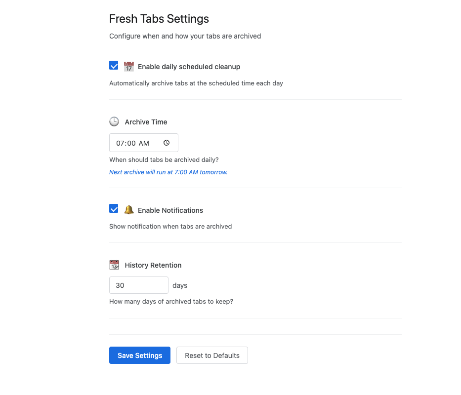

# 🌅 Fresh Tabs --- Chrome Extension

**Fresh Tabs** helps you start every day with a clean browser. Each morning, Fresh Tabs automatically archives and closes your unpinned tabs, giving you a fresh, clutter‑free start. You can also manually archive tabs anytime with a single click.

---

## ✨ Features
✅ Automatically archives & closes unpinned tabs daily at your chosen time  
✅ Warm, dynamic notification & badge showing archived tab count  
✅ Manual "Archive & Refresh Now" button in the popup  
✅ Preserves pinned tabs --- they remain open  
✅ Search & view archived tabs by date & title  
✅ Settings page to customize archive time, enable/disable daily scheduling, enable/disable notifications, and retention period

---

## 🖼️ Screenshots
| Popup UI | Options Page |
|----------|--------------|
|  |  |

---

## ⚙️ Settings
You can adjust settings in the extension's options page:
- 📅 **Archive Time:** Choose the time of day for automatic cleanup
- 🔔 **Enable Notifications:** Show a warm message each time tabs are archived
- 🧹 **Retention Period:** Number of days to keep archived history
- ⏲️ **Enable Daily Scheduled Cleanup:** Toggle daily cleanup on or off

---

## 🚀 Installation
### From Source
1\. Clone this repository:
 ```bash
 git clone <repo-url>
2.  Open Chrome and navigate to chrome://extensions/
3.  Enable Developer Mode (top right)
4.  Click Load unpacked and select the project folder

⸻

📦 Folder Structure
fresh-tabs-extension/
├── background.js
├── manifest.json
├── options.html
├── options.js
├── options.css
├── popup.html
├── popup.js
├── popup.css
├── icons/
│  ├── icon16.png
│  ├── icon32.png
│  ├── icon48.png
│  └── icon128.png
├── .gitignore
├── README.md

⸻

📝 License
MIT

⸻

👏 Contributing
Pull requests welcome! Please open an issue to discuss changes or improvements first.