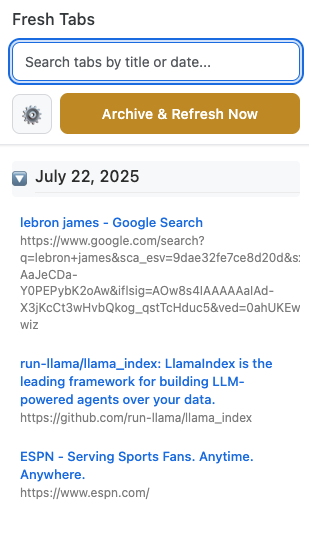

# 🌅 Fresh Tabs --- Chrome Extension

**Fresh Tabs** helps you start every day with a clean browser. Each morning, Fresh Tabs automatically archives and closes your unpinned tabs, giving you a fresh, clutter‑free start. You can also manually archive tabs anytime with a single click.

---

## ✨ Features  

✅ Automatically archives & closes unpinned tabs daily at your chosen time  
✅ Opens a beautiful **Welcome Tab** each morning:
  - Warm greeting and archive summary  
  - Scrollable list of archived tabs  
  - Optional “Today’s Focus” input  
  - Rotating inspirational quote  
  - Accessible Settings icon 
  
✅ Manual "Archive & Refresh Now" button in the popup  
✅ Preserves pinned tabs — they remain open  
✅ Search & view archived tabs by date & title  
✅ Settings page to customize archive time, scheduling, notifications, and retention   period  

---

## 🖼️ Screenshots
| Popup UI | Options Page |
|----------|--------------|
|  |  |

---

## ⚙️ Settings
You can adjust settings in the extension's options page:
- 📅 **Archive Time:** Choose the time of day for automatic cleanup
- 🔔 **Enable Notifications:** Show a warm message each time tabs are archived
- 🧹 **Retention Period:** Number of days to keep archived history
- ⏲️ **Enable Daily Scheduled Cleanup:** Toggle daily cleanup on or off

---

## 🚀 Installation
### From Source
1. Clone this repository:
```bash
   git clone <repo-url>
   ```
2.  Open Chrome and navigate to chrome://extensions/
3.  Enable Developer Mode (top right)
4.  Click Load unpacked and select the project folder

---

## 📂 Folder Structure

```text
morning-tab-cleaner/
├── background_complete.js
├── manifest.json
├── options.html
├── options.js
├── options.css
├── popup.html
├── popup.js
├── popup.css
├── icons/
│   ├── icon16.png
│   ├── icon32.png
│   ├── icon48.png
│   └── icon128.png
├── .gitignore
└── README.md
```

---

## 📝 License
MIT

---

## 👏 Contributing
Pull requests welcome! Please open an issue to discuss changes or improvements first.